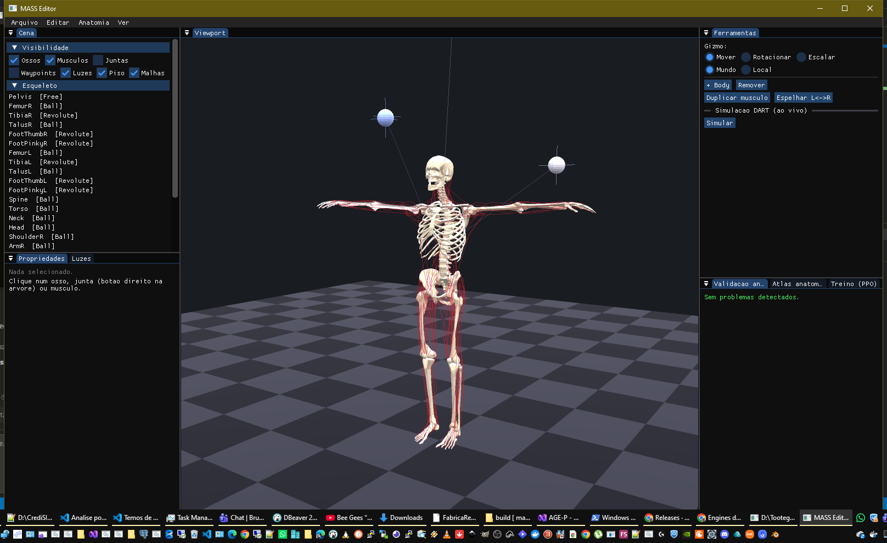

# MASS-Easy

**Um fork do [MASS](https://github.com/lsw9021/MASS) (Muscle-Actuated Skeletal System) focado em ser fácil de usar, nativo no Windows, e viável para animação.**



O MASS original é um simulador musculoesquelético de corpo inteiro controlado por Deep Reinforcement Learning (SIGGRAPH 2019). É poderoso, mas difícil de instalar e operar — só Linux, dependências pesadas, e todo o modelo (esqueleto, 284 músculos, movimentos) vive em arquivos XML/BVH editados à mão.

O **MASS-Easy** mantém o motor de simulação e o pipeline de treino, e adiciona por cima:

- ✅ **Build nativo no Windows** (MSVC + vcpkg + PyTorch CUDA) — sem WSL, sem Docker.
- ✅ **Editor 3D unificado** — esqueleto, músculos e movimento numa só visão interativa em tempo real.
- ✅ **Formato de projeto único `.mass`** (JSON) que desmembra nos arquivos de treino.
- 🚧 **Rumo à animação** — física DART ao vivo no editor, iluminação, malhas anatômicas reais; caminhando para um pipeline de animação de fato utilizável.

> Este é um projeto derivado. Todo o crédito da pesquisa e do método é dos autores originais — ver [Créditos](#créditos).

---

## O editor

Aplicação C++ nativa (GLFW + Dear ImGui + ImGuizmo + OpenGL) que edita os três elementos do modelo numa mesma cena 3D:

| Recurso | Descrição |
|---|---|
| **Esqueleto** | Ossos como **malhas anatômicas reais** (crânio, costelas, coluna, membros), vindas do próprio modelo. Clicáveis, com gizmo de transformação. |
| **Músculos** | 284 unidades Hill desenhadas pelos waypoints; edição de `f0/lm/lt/pen_angle`, PCSA→f0, metadados anatômicos, espelhamento L↔R. |
| **Movimento** | Referência BVH tocada ao vivo (modo cinemático) ou física dinâmica (DART, forças musculares). |
| **Iluminação** | Sistema de luzes (direcional/ponto) com painel para adicionar/remover/editar, marcadores clicáveis no viewport. |
| **Atlas** | Importa parâmetros de referência de modelos OpenSim (`.osim`). |
| **Treino** | Servidor de telemetria (asio) — dispara o treino PPO e mostra o reward ao vivo. |

Renderização com malhas em GPU, supersampling (SSAA), painel de visibilidade por grupo (ossos/músculos/juntas/waypoints/luzes/piso).

---

## Início rápido (Windows)

Pré-requisitos e setup completo em **[Docs/](Docs/README.md)**. Resumo:

```powershell
# 1. compilar tudo (core, binding python, viewer, editor) e empacotar em Dist\x64
powershell -ExecutionPolicy Bypass -File scripts\build-dist.ps1

# 2. abrir o editor 3D
powershell -ExecutionPolicy Bypass -File scripts\editor.ps1

# 3. treinar (PPO na GPU)
powershell -ExecutionPolicy Bypass -File scripts\train.ps1

# 4. ver uma política treinada no viewer original
powershell -ExecutionPolicy Bypass -File scripts\view.ps1 -Nn ..\nn\max.pt -MuscleNn ..\nn\max_muscle.pt
```

Documentação por tarefa:

| # | Tarefa |
|---|--------|
| 1 | [Requisitos e setup](Docs/01-Requisitos-e-Setup.md) |
| 2 | [Build](Docs/02-Build.md) |
| 3 | [Viewer](Docs/03-Executar-Viewer.md) |
| 4 | [Treino](Docs/04-Treinar.md) |
| 5 | [Troubleshooting](Docs/05-Troubleshooting.md) |
| 6 | [Editor 3D](Docs/06-Editor.md) |

---

## Arquitetura

```
.mass (JSON: esqueleto + músculos + movimentos + treino + anatomia + cena)
   │  editado no Editor 3D ── física DART ao vivo ── bridge asio ↔ treino Python
   ▼ "Exportar para treino" desmembra
human.xml + muscle284.xml + metadata.txt + *.bvh  →  treino PPO (PyTorch/CUDA)  →  nn/*.pt
```

- `core/` — biblioteca C++ `mss` (DART 6.15 + Bullet, músculos Hill, ambiente RL).
- `python/` — módulo `pymss` (pybind11) + loop PPO (`main.py`, `Model.py`).
- `render/` — viewer OpenGL do MASS original (roda modelos `.pt`).
- `editor/` — o editor 3D unificado do MASS-Easy.
- `scripts/` — build/run em PowerShell. `Docs/` — guias por tarefa.

---

## Roadmap

- [x] Port nativo Windows (MSVC/vcpkg/CUDA)
- [x] Editor 3D unificado (esqueleto + músculos + movimento)
- [x] Projeto `.mass` + export para treino (round-trip validado)
- [x] Física DART ao vivo no editor
- [x] Malhas anatômicas reais + iluminação + GPU/SSAA
- [ ] Materiais/texturas, PBR, sombras, oclusão de ambiente
- [ ] Malha de pele sobre o esqueleto
- [ ] Retargeting anatômico ao escalar ossos (estilo GaitNet)
- [ ] Exportação para pipelines de animação (FBX/glTF)

---

## Créditos

Baseado no **MASS — Scalable Muscle-actuated Human Simulation and Control**:

- Repositório original: https://github.com/lsw9021/MASS
- Página do projeto: http://mrl.snu.ac.kr/research/ProjectScalable/Page.htm
- Artigo (SIGGRAPH 2019): http://mrl.snu.ac.kr/research/ProjectScalable/Paper.pdf
- Vídeo: https://youtu.be/a3jfyJ9JVeM

Seunghwan Lee, Kyoungmin Lee, Moonseok Park, Jehee Lee.
*Scalable Muscle-actuated Human Simulation and Control.* ACM Transactions on Graphics (SIGGRAPH 2019), Volume 37, Article 73.

## Licença

Segue a licença do projeto original — ver [LICENSE](LICENSE).
